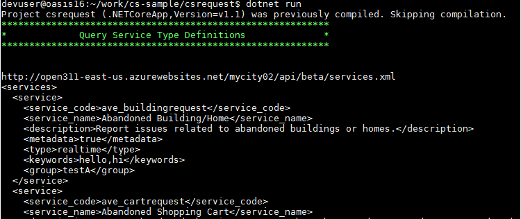
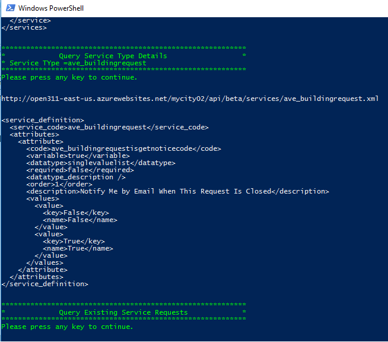
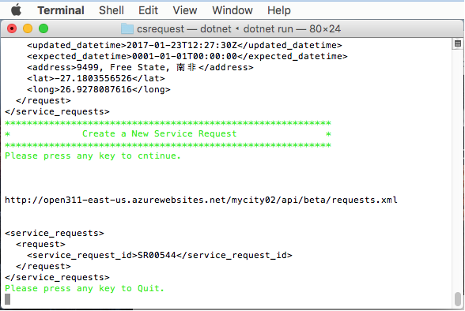

# Citizen Services: Open311 API Console App

This project contains sample code to demonstrate the usage of AvePoint Citizen Services API to query and create service requests. The API is compatible with Open311 [GeoReport v2](http://wiki.open311.org/GeoReport_v2/) API protocol standards.

The code is written in C# and run in .Net core framework. To build the code you must have .Net core SDK installed. Instructions to install .Net core SDK can be found on  the Microsoft [.Net core download](https://www.microsoft.com/net/download/core) site.  

##Getting Start

First you must update the configuration with your AvePoint Citizen Services tenant information. Modify the following lines:

``` C#
            string baseAddress = "https://api.citizenservices.org";
            string jurisdictionId = "your_tenant";   
            string format = "xml";
            string id = "ave_buildingrequest";   //  The service type you will create new request
            string accessToken = "your_api_key_created_by_tenant_admin";
```            

The code will walk you through running the operations:

* List all the available Service Request Types by using query service list API

``` C#
        public async Task<string> GetServicesAsync()
        {
            var response = await client.GetAsync($"/{jurisdictionId}/api/beta/services.{format}", token);

            if ("xml".Equals(format, StringComparison.OrdinalIgnoreCase))
            {
                return XDocument.Parse(await response.Content.ReadAsStringAsync()).ToString();
            }
            return JToken.Parse(await response.Content.ReadAsStringAsync()).ToString(Newtonsoft.Json.Formatting.Indented);
        }

```

* List detailed information for a single service request type

``` C#
        public async Task<string> GetServiceByIdAsync(string id)
        {
            var response = await client.GetAsync($"/{jurisdictionId}/api/beta/services/{id}.{format}", token);

            if ("xml".Equals(format, StringComparison.OrdinalIgnoreCase))
            {
                return XDocument.Parse(await response.Content.ReadAsStringAsync()).ToString();
            }
            return JToken.Parse(await response.Content.ReadAsStringAsync()).ToString(Newtonsoft.Json.Formatting.Indented);
        }
```

* List all existing Service Requests for the speficied service request type, filtered by time range

``` C#
        public async Task<string> GetServiceRequestsAsync(string queryString)
        {
            var response = await client.GetAsync($"/{jurisdictionId}/api/beta/requests.{format}?{queryString}", token);

            if ("xml".Equals(format, StringComparison.OrdinalIgnoreCase))
            {
                return XDocument.Parse(await response.Content.ReadAsStringAsync()).ToString();
            }
            return JToken.Parse(await response.Content.ReadAsStringAsync()).ToString(Newtonsoft.Json.Formatting.Indented);
        }
```

* Create a new Service Request using the create request API


``` C#
        public async Task<string> PostServiceRequest(IEnumerable<KeyValuePair<string, string>> request)
        {
            var response = await client.PostAsync($"/{jurisdictionId}/api/beta/requests.{format}", new FormUrlEncodedContent(request));

            if ("xml".Equals(format, StringComparison.OrdinalIgnoreCase))
            {
                return XDocument.Parse(await response.Content.ReadAsStringAsync()).ToString();
            }
            return JToken.Parse(await response.Content.ReadAsStringAsync()).ToString(Newtonsoft.Json.Formatting.Indented);
        }
```

###Linux OS

The .Net cli on Linux uses project.json file for the .Net core project. You may edit the project.json file to add more packages.

Following the [instructions](https://www.microsoft.com/net/core#macos) Install the dotnet core SDK. 
Then run the command below to build:

```
dotnet restore
dotnet build
```
then run the application:

```
dotnet run
```

The image below shows the application retrieving the Citizen Service site service list on Ubuntu 16.04:



###Windows

The new .Net cli tool will use the .csproj file for the .Net core project. You must modify the .csproj file to add/remove additional packages. The steps to build and run the application is the same:

```
dotnet restore
dotnet build
```
then run the application:

```
dotnet run
```

The image below shows the application query for one service type details:



###Mac OS

The .Net cli on Mac OS still uses project.json file for the .Net core project. Following the [instructions](https://www.microsoft.com/net/core#macos) Install the dotnet core SDK. 
Start a terminal windows and run the command below to build:

```
dotnet restore
dotnet build
```
then run the application:

```
dotnet run
```
The image below shows one new service request is created with API:




